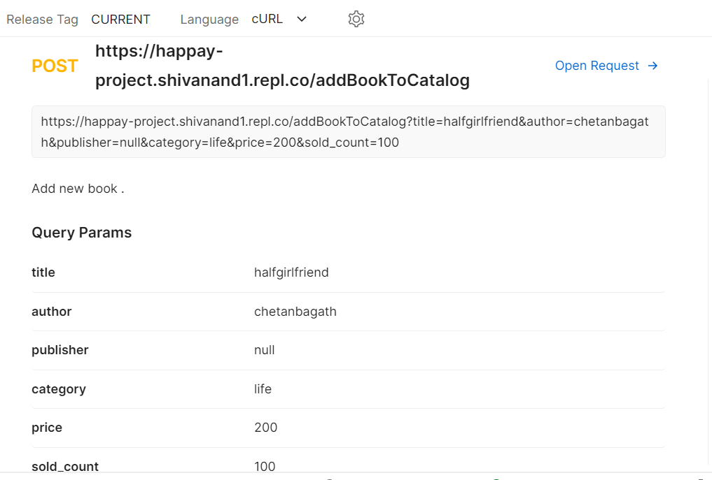
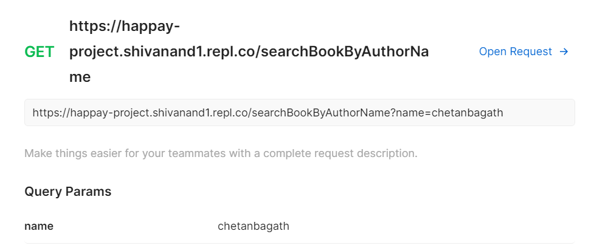
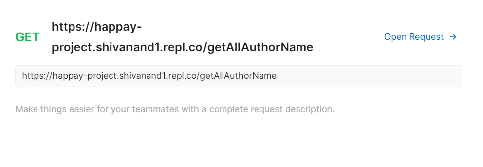
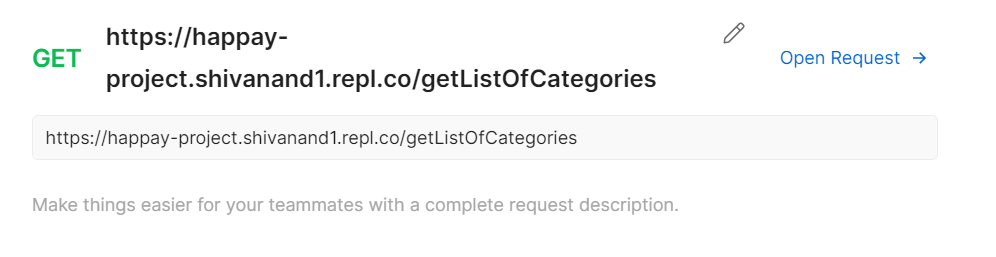
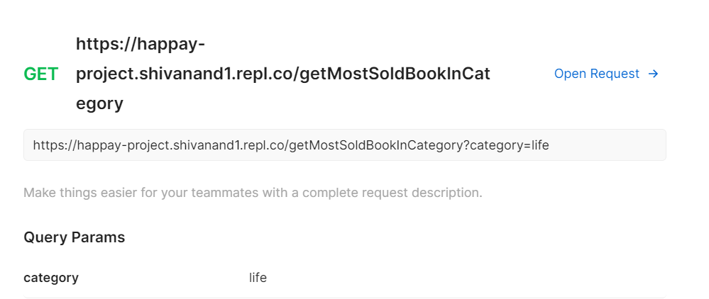
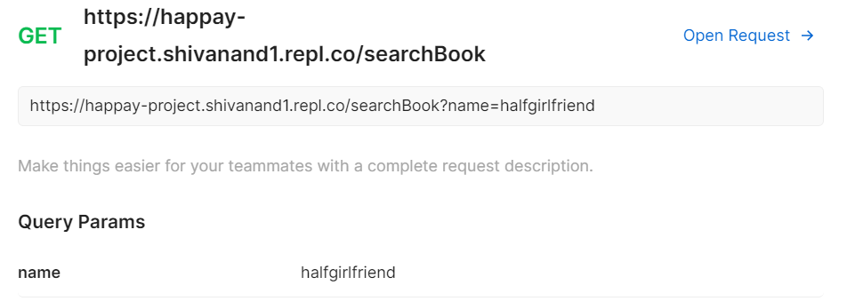

Introduction

HAPPAY Project contains main.py file and bookstore.db database where sqllite database is already created for test purpose.

Click on link 
https://replit.com/@shivanand1/HAPPAY-PROJECT#main.py 
where code built using replit servers.

Run the project ,web page will open along site with html page reading "welcome to HAPPAY project"

Copy the url from this page and open in google chrome
example:https://HAPPAY-PROJECT.shivanand1.repl.co

APIs are created and generated details for these postaman api tesing tool.

APIs

1.addAnAuthor
Arguments
name: str value
phone_number: Integer number
birth_date: Specify in the DD-MM-YYYY format
death_date: Specify in the DD-MM-YYYY format

Documentation
Add a new author to the existing author list.

Example:

2.addBookToCatalog

Arguments
title:  str value
author_id:  str value
publisher:  str value
category_id: str value
price:  str value
sold_count: str value

Documentation
Add the new given book to the existing book list.

Example: 

3.searchBookbyAuthorname

Arguments
author_name: str value

Documentation
Search the book by author name in the list.

Example: 

4.getAllAuthorName

Documentation
Get all author names from the author list.

Example: 

5.getListOfCategories

Documentation
Get the list of categories from the book list.

Example: 

6.getMostSoldBookInCategory

Arguments
category: str value

Documentation
Get the most sold book from the given category.

Example: 

7.searchBookbyBookname

Arguments
book_name: str value

Documentation
Search the book in the book list by the given book name.
Example: 

